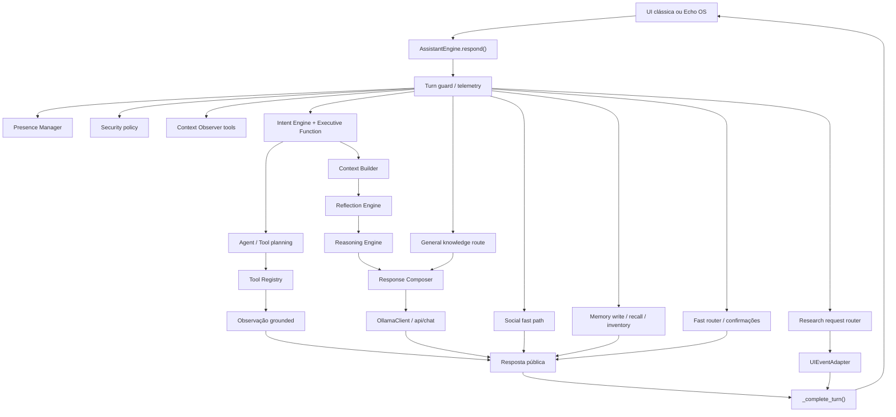
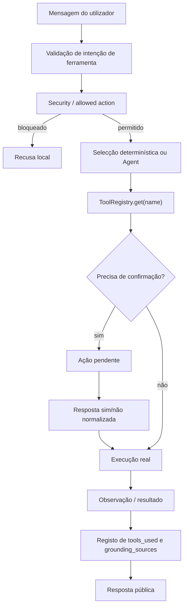
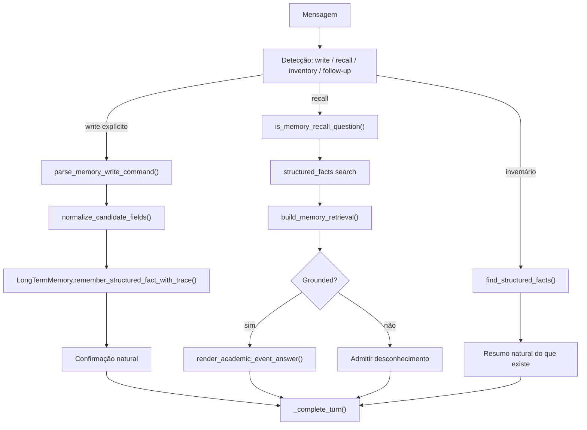
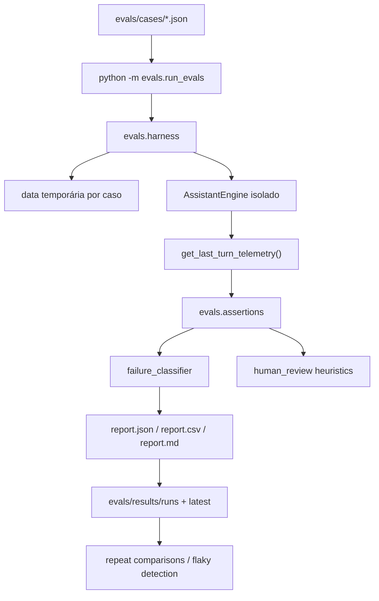

# Echo Architecture

Data: 2026-07-22  
Commit auditado: `3f6cca7`

Este documento descreve a arquitectura actual do Echo. Distingue caminhos determinísticos de chamadas ao LLM e marca os pontos onde existem ferramentas reais.

## A. Fluxo Principal

### Caminhos determinísticos

- Fast router;
- segurança;
- presença;
- conversa social simples;
- pesquisa quando não há ferramenta real;
- consulta/escrita estruturada de memória quando grounded;
- tarefas;
- perguntas sobre janela/aplicação via Context Observer;
- CLEAR/topic shift.

### Caminhos com LLM

- Response Composer;
- Agent tool selector quando heurísticas não resolvem;
- resumos via `OllamaClient.summarize_text()`;
- embeddings via `/api/embeddings`;
- Voice Critic quando activado por configuração/caminho.

## B. Fluxo De Ferramenta

Ferramentas reais actuais:

- workspace: listar, ler, criar ficheiro;
- tarefas: listar, concluir, cancelar, adiar;
- contexto: janela activa, aplicação activa, janelas abertas, actividade recente, snapshot, resumo;
- desktop actions: abrir app, URL, pasta, ficheiro, projecto com confirmação.

Ferramentas ausentes:

- web search real;
- browser control real;
- providers externos;
- TTS/wake word.

## C. Fluxo De Memória

### Notas

- Conversation memory e persistent memory estão separadas.
- Personal Model usa base própria.
- Session summaries usam base própria.
- O Response Composer não deve copiar memórias literalmente; deve interpretar, contextualizar e integrar.

## D. Fluxo Dos Evals

### Garantias dos evals

- Não usa `data/` real.
- Cada caso tem directório temporário.
- Setup pode semear factos estruturados.
- Assertions verificam routing, ferramentas, linguagem, claims, memória e latência.

## E. Componentes Principais

| Camada | Código | Estado |
|---|---|---|
| Entrypoint | `app.py` | Implementado |
| UI clássica | `ui/main_window.py` | Implementado |
| Echo OS | `prototype_web_ui/*` | Protótipo funcional |
| Engine | `assistant/conversation.py` | Implementado, complexo |
| Agent | `assistant/agent.py` | Implementado/parcial |
| Tool registry | `assistant/tool_registry.py`, `assistant/tools.py` | Implementado |
| Cognição | `assistant/cognition/*` | Parcial |
| Response composer | `assistant/response_composer.py` | Implementado |
| Memória | `assistant/long_term_memory.py`, `assistant/memory.py` | Implementado/parcial |
| Personal Model | `assistant/personal_model.py` | Implementado inicial |
| Session Manager | `assistant/session_manager.py` | Implementado/parcial |
| Context Observer | `assistant/context_observer.py` | Implementado/parcial |
| Providers | `assistant/llm.py`, `assistant/model_provider.py` | Parcial |
| Evals | `evals/*` | Implementado |

## F. Pontos De Atenção

- `AssistantEngine` está a tornar-se o ponto de acoplamento de quase tudo.
- `ModelProvider` ainda não substitui `OllamaClient` no runtime.
- Echo OS tem eventos, mas ainda não tem workspaces maduros.
- Pesquisa visual existe antes da pesquisa real.
- Memória precisa de limpeza antes de ser usada como conhecimento confiável.
